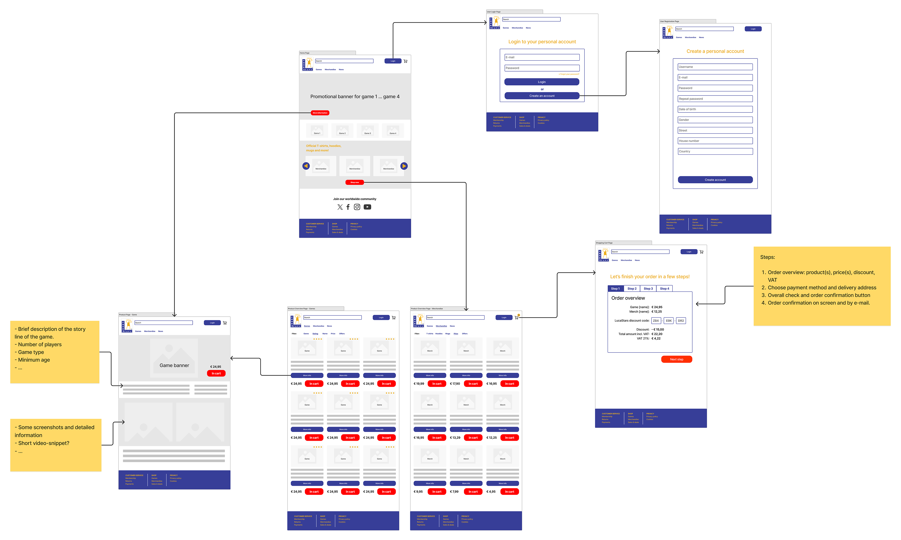

# Wireframe

## Content

LucaStars has designed a wireframe for the webshop. Use it as a basis for the front-end. Changes are allowed but with respect to the corporate identity and only in consultation with the Product Owner. The wireframe isn't complete. So when you add pages, respect the initial design.

In this folder you find two files:

-   wireframe - concept.jam
-   wireframe - concept.png

The .jam file is a Figma design. You can open it in [Figma](https://www.figma.com) with your student account.
The .png file is a screenshot of the wireframe.

## Preview

https://www.figma.com/board/5uXYvZOVEPYL4Wx1tnPnOG/wireframe-concept?node-id=0-1&t=mxoG6Qw4eQc17Orx-0
